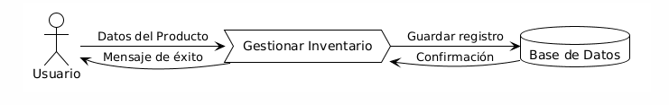
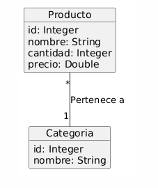
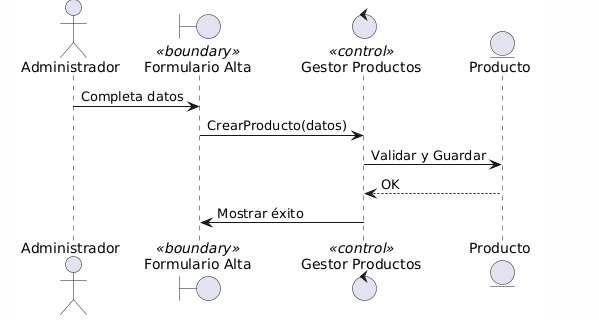
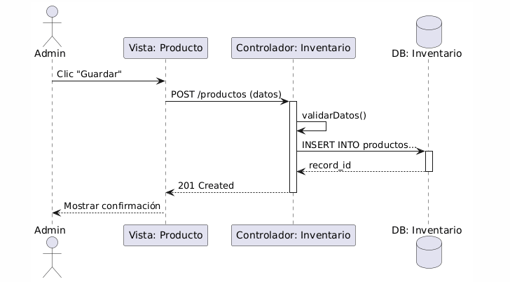
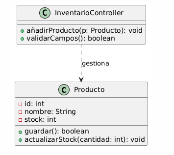

# Práctica 1: Metodologías de Desarrollo en Cascada



## 1. Análisis de Requerimientos

### Ejercicio 1: Requisitos
*   **Funcionales:** Registrar productos, editar stock, eliminar productos, listar inventario, alertas de bajo stock.
*   **No Funcionales:** Tiempo de respuesta < 2s, interfaz web responsiva, autenticación mediante JWT, base de datos relacional.

### Ejercicio 2: Caso de Uso "Agregar Producto"
*   **Actor:** Administrador de Inventario.
*   **Precondición:** El usuario está autenticado.
*   **Flujo:** El usuario ingresa nombre, cantidad y precio. El sistema valida los datos y guarda en la BD.
*   **Postcondición:** El producto aparece en la lista global.

---

## 2. Diseño del Sistema y Programa

### Ejercicio 3: Diagrama de Flujo de Datos
*(Ver diagramas en la sección de diseño detallado)*

### Ejercicio 5 y 6: Arquitectura y Base de Datos


*   **Arquitectura:** Cliente-Servidor (MVC). Justificación: Separa la lógica de negocio de la interfaz, facilitando el mantenimiento.
*   **BD:** Relacional (SQL Server).

---

## 4. Diseño Detallado

### 1. Diagrama de Dominio


### 2. Diagrama de Robustez (Análisis de "Agregar Producto")


### 3. Diagrama de Secuencia


### 4. Diagrama de Clases
*(Implementado en la lógica de código a continuación)*

---

## 7. Implementación de la Funcionalidad (Capa de Acceso/Controlador)
**Ejercicio Nro: 7** - Este código representa el controlador encargado de recibir las peticiones.

```python
from flask import Flask, request, jsonify
from logica_negocio import InventarioService

app = Flask(__name__)
service = InventarioService()

@app.route('/productos', methods=['POST'])
def agregar_producto():
    datos = request.get_json()
    # El controlador coordina: recibe datos y solicita registro
    resultado = service.validar_y_registrar(datos)
    
    if resultado["exito"]:
        return jsonify({"mensaje": "Producto agregado", "id": resultado["id"]}), 201
    else:
        return jsonify({"error": resultado["error"]}), 400

if __name__ == '__main__':
    app.run(debug=True)
```

---

## 8. Implementación de la Lógica de Negocio
**Ejercicio Nro: 8** - Reglas de negocio solicitadas por el cliente.

```python
class InventarioService:
    def __init__(self):
        # Base de datos en memoria para propósitos de la práctica
        self.bd_productos = []

    def validar_y_registrar(self, datos):
        nombre = datos.get("nombre")
        cantidad = datos.get("cantidad", 0)
        precio = datos.get("precio", 0)

        # Regla 1: Nombre obligatorio
        if not nombre:
            return {"exito": False, "error": "El nombre es obligatorio"}

        # Regla 2: Stock no negativo
        if cantidad < 0:
            return {"exito": False, "error": "La cantidad no puede ser menor a cero"}

        # Regla 3: Precio positivo
        if precio <= 0:
            return {"exito": False, "error": "El precio debe ser mayor a cero"}

        nuevo_id = len(self.bd_productos) + 1
        nuevo_producto = {
            "id": nuevo_id,
            "nombre": nombre,
            "cantidad": cantidad,
            "precio": precio
        }
        self.bd_productos.append(nuevo_producto)
        return {"exito": True, "id": nuevo_id}
```

---

## 5. Pruebas y Despliegue

### Ejercicio 10: Pruebas Unitarias
Se validan las reglas de negocio de forma aislada.

```python
import unittest
from logica_negocio import InventarioService

class TestAgregarProducto(unittest.TestCase):
    def setUp(self):
        self.service = InventarioService()

    def test_registro_exitoso(self):
        datos = {"nombre": "Teclado", "cantidad": 10, "precio": 25.50}
        resultado = self.service.validar_y_registrar(datos)
        self.assertTrue(resultado["exito"])

    def test_nombre_obligatorio(self):
        datos = {"nombre": "", "cantidad": 5, "precio": 10}
        resultado = self.service.validar_y_registrar(datos)
        self.assertEqual(resultado["error"], "El nombre es obligatorio")
```

### Ejercicio 11: Plan de Despliegue
1.  **Servidor:** Configuración de Nginx/Apache.
2.  **Base de Datos:** Migración de esquemas a SQL Server.
3.  **Entorno:** Configuración de variables de entorno y SSL.

### Ejercicio 13: Mantenimiento
*   Monitorización de logs de errores.
*   Backups semanales de la base de datos.
*   Parches de seguridad mensuales.

---

## 8. Retos: IA Generativa

### Ejercicio 15: Roles para Proyecto de IA
1.  **Product Owner:** Define el dominio de aplicación.
2.  **ML Engineer:** Ajuste del modelo (LLM).
3.  **Prompt Engineer:** Optimización de instrucciones.
4.  **Backend Dev:** Integración de API de IA.
5.  **QA Tester:** Evaluación de precisión y sesgos.
